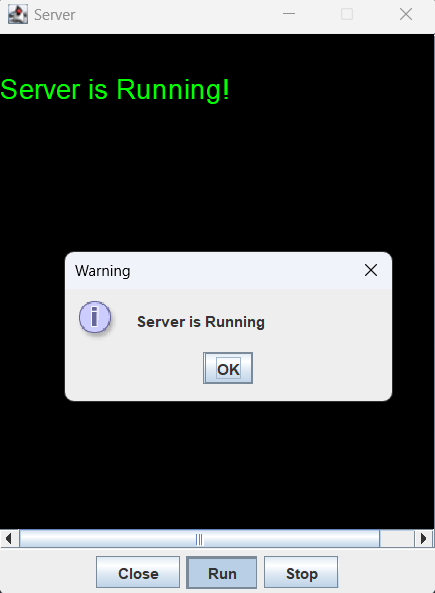
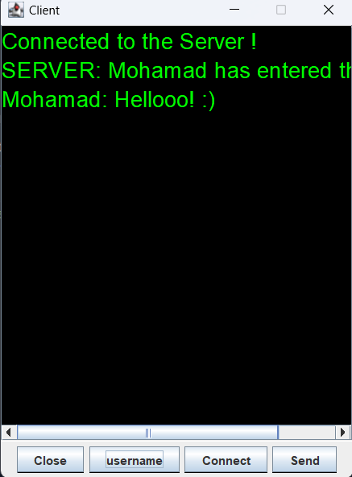

# Socket programing sample

This project is an example Code of `socket programming` written fully in `Java` !\
In this project we have a `server` and multiple `clients` which can chat with each other!

# Running Guide
- #### step 1: Run the `Server/src/nilian/ServerMain.java` file.
- #### step 2: Start the server by clicking on `start Button`.
- #### step 3: Run `Client/src/nilian/ClientMain.java` file 2 or 3 times to have multiple clients.
- #### step 4: Set username for each nilian.client.Client by clicking on `username button`.
- #### step 5: Have fun chatting between clients  :)

# Pictures

    Server

    Client

